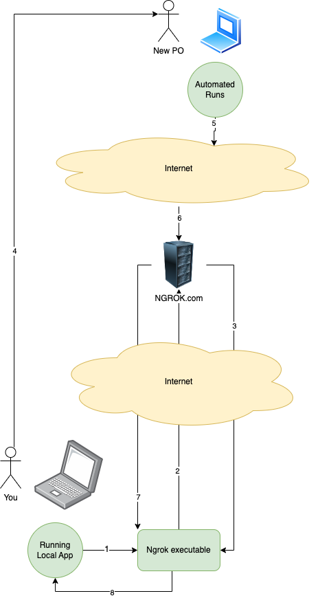

# Automated Runs

To be able to test your application automatically it will need to connect to our server which will automatically run test scenario's against it. For this you will need to expose your localhost to the internet, we recommend [ngrok](https://ngrok.com/), but you’re free to use anything you like.

## Using ngrok for making ypur application available to the automated run server

Ngrok is a useful utility to create secure tunnels to locally hosted applications using a reverse proxy. It is a utility to expose any locally hosted application over the web. In simple terms, it provides a publicly accessible web URL to any locally hosted application.

### How Does Ngrok Work?

Not that it really matters but for those interested how the automated users will be simulated using nrgok below a flow explanation. 

1. You run your local application so that it can be accessed at your localhost.
2. Now with ngrok executable initiate a tunnel to the localhost on the desired port.
3. Once ngrok sets up the tunnel, it provides a public web-accessible URL.
4. Now share the publicly accessible url with the end-users who would hit the locally hosted application.
5. The autoamted User application  will hit the web URL on the internet.
6. When the request arrives at the ngrok server (As the URL is in a subdomain of ngrok.com the requests will initially land to ngrok server), and it will resolve the URL to the app that it needs to tunnel to.
7. Ngrok forwards the request to the tunnel created in Step 2.
8. The forwarded request connects to the locally hosted app.

 

### Setup

Make sure you have ngrok configured correctly. If unsure, please visit [NGROK Dashbaord](https://ngrok.com/docs/getting-started/) You can log on to NGROK with your Github account. The dashbaord will help you setting ngrok up on your pc

+ Install NGROK: brew install ngrok/ngrok/ngrok
+ Add your authtoken to the default ngrok.yml configuration file. ngrok config add-authtoken SomeToken
+ Start a tunnel: ngrok http --domain=YourPersonalDomain 80

`ngrok http 8080` should  setup the tunnel. Copy the generated url from the commandline.
You can also visit https://dashboard.ngrok.com/cloud-edge/endpoints to see the endpoints you are exposing.

## Registering on our hands-on server

Go to provided Url of the Automated Test Server.
Add the url you got from ngrok as a client url when asked, and validate the connection.

Now the Automates Test Server is able to send it instructions to your application.

You are now ready to start. Follow the instructions for the exercises.

